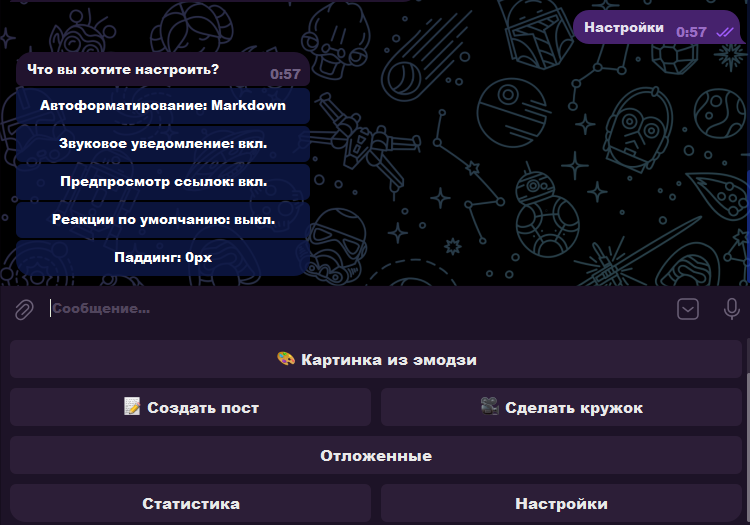
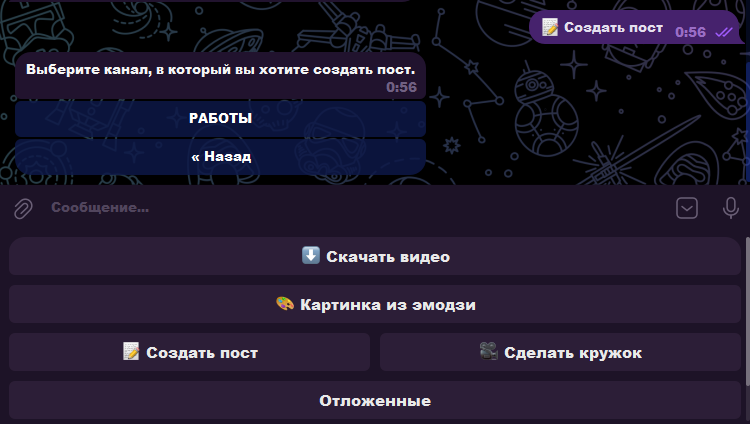
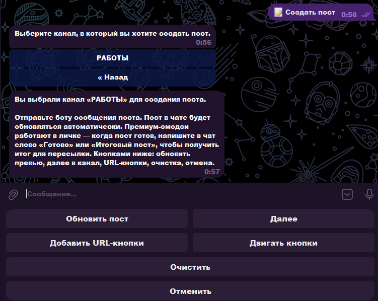
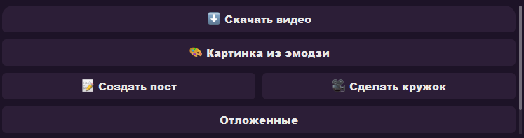
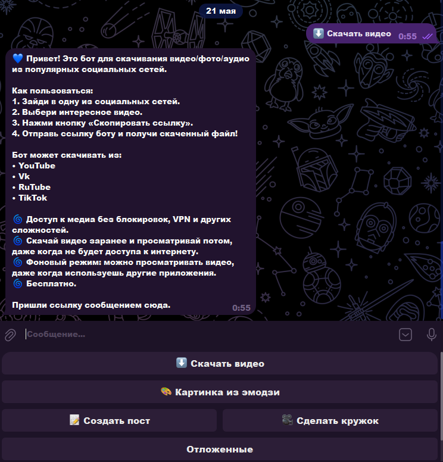
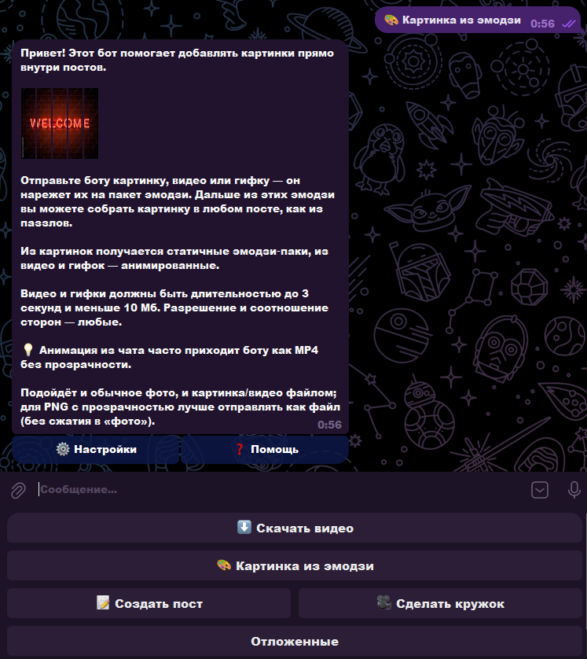

# InsrumentsBOT — Telegram‑хаб для SMM‑специалистов

> [!IMPORTANT]
> **Коммерческий проект.** Разработка **под заказ** для **SMM‑специалистов** и ведения Telegram‑каналов: посты, медиа, отложка, премиум‑оформление. **Продукт передан заказчику.** В репозитории — только описание и скриншоты, **исходный код не публикуется**.

## 💡 Кратко

**InsrumentsBOT** — связка **центрального бота‑хаба** и **отдельных publisher‑ботов** (свой токен на каждого «постера» под клиента или команду). Для SMM: конструктор постов в канал без сторонних controller‑ботов, скачивание роликов по ссылке, кружки из видео/MKV, премиум‑эмодзи, «картинки из эмодзи», URL‑кнопки с цветами, Markdown/HTML и **отложенная публикация** с учётом таймзоны канала.

## ✅ Что реализовано

### Хаб (`bot.py`)
- **Видео → кружок**: ffmpeg, квадрат 640×640, обрезка по длительности; вход — MP4, MKV и др. (удобно для 3D‑роликов).
- **Каналы**: добавление по пересылке, список «Мои каналы», синхронизация, часовой пояс по городу.
- **Боты пользователей**: хранение токенов publisher‑ботов в `bots.json`, автозапуск процессов `publisher_run`.
- **MTProto (Telethon)**: привязка user‑сессии для премиум‑эмодзи и проверок в канале.
- Защита от двойного запуска (lock‑файл), опционально **локальный Bot API** для файлов > 50 МБ.

### Publisher (`publisher.py`)
- **Скачать видео**: ссылки YouTube, VK, RuTube, TikTok → файл в чат (для контента в постах).
- **Создать пост**: переслать текст/фото/видео/стикеры — черновик под выбранный канал, превью в чате.
- **URL‑кнопки**: мастер «название → ссылка → цвет» (success / primary / danger), до 3 кнопок в ряд через `|`.
- **Премиум‑эмодзи** в тексте поста и в подписях кнопок; публикация с донастройкой entities после отложки.
- **Картинка из эмодзи**: нарезка кадра/анимации на сетку, custom emoji sticker set, вставка `<tg-emoji>` в пост.
- **Автоформатирование** Markdown / HTML, превью и «Обновить пост» в чате.
- **Отложка** с учётом таймзоны канала; фоновый edit премиум‑оформления после выхода поста в эфир.
- Публикация в канал: одиночные сообщения и **media group** (альбомы).

### Инфраструктура
- Состояние: `publisher_state.json`, `channels.json`, `hub_sessions.json` (шифрование сессий по `HUB_SESSION_SECRET`).
- Деплой на **Ubuntu**: systemd (`insruments-bot`, `insruments-publisher`), ffmpeg, venv, rsync‑скрипты (`DEPLOY_UBUNTU.md`).

## 🔌 Интеграции

- **Telegram Bot API** (aiogram 2), при необходимости **локальный telegram-bot-api**.
- **Telethon** (MTProto) для сессий и премиум‑сценариев.
- **ffmpeg** / ffprobe — кружки, эмодзи‑сетки, сжатие видео.

## 🧰 Технологии

| Категория | Стек |
|-----------|------|
| Язык | Python 3 |
| Telegram | aiogram 2, Telethon |
| Медиа | ffmpeg, ffprobe |
| Хранение | JSON (боты, каналы, черновики, отложки) |
| Инфраструктура | Ubuntu, systemd, bash, опционально local Bot API |

## 🎯 Для кого и зачем

- **SMM‑специалисты** и админы каналов: один инструмент вместо набора «постеров» и ручной возни в клиенте.
- Богатые посты: кнопки, премиум‑эмодзи, альбомы, отложка, настройки форматирования.
- Контент под пост: скачать ролик по ссылке, сделать кружок, собрать «картинку из эмодзи».

## 🤝 Формат работы

Заказ на фрилансе: проектирование под задачи SMM, реализация, деплой на VPS, передача заказчику. Сопровождение и доработки по обратной связи.

## 🖼️ Скриншоты

| # | Экран |
|---|--------|
| 1 | Настройки: автоформатирование, превью ссылок, паддинг |
| 2 | Создать пост → выбор канала |
| 3 | Редактор поста: превью, URL‑кнопки, «Готово» |
| 4 | Главное меню инструментов |
| 5 | Скачать видео (YouTube, VK, RuTube, TikTok) |
| 6 | Картинка из эмодзи: онбординг и пример |

Файлы — в [`docs/`](docs/).

## Исходный код

> [!NOTE]
> **Коммерческая разработка для SMM‑специалистов** — исходники **не в этом репозитории** и не публикуются. Продукт **передан заказчику**. По запросу для работодателя — краткий разбор архитектуры (хаб ↔ publisher, state, MTProto) без токенов и данных заказчика.

## Лицензия

> [!CAUTION]
> Описание и скриншоты — для портфолио. **Не личный pet‑project:** заказ под SMM, права на код у заказчика. Токены, сессии MTProto и конфиги здесь не размещаются.
